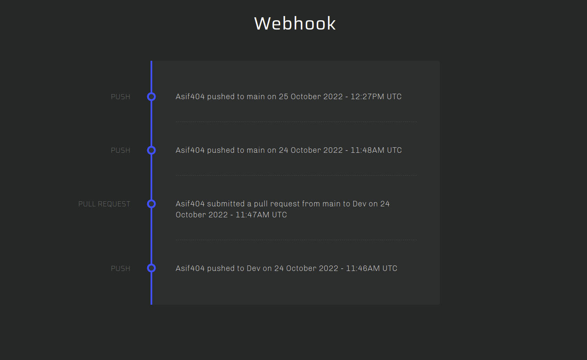

# webhook-repo

## Installation

Clone this repository

`git clone https://github.com/Asif404/webhook-repo.git` 

`cd webhook-repo`

Use any virtual environment of your choice. 

`pip3 install requirements.txt`

Configure your database uri inside `/app/__ini__.py` file 

run app:

`python3 run.py`

## UI 

